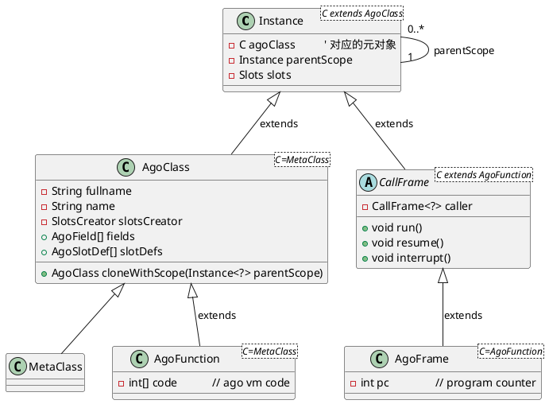

# ago 语言语法手册（syntax.md）

# 1. 使用指南（User Guide）

###  语言入门

> **目标**：在本节中我们将带你完成一次完整的 *Hello, ago!* 演示，帮助你快速验证环境是否搭建成功，并了解“编译 → 运行”这一基本流程。  
> 本手册假设你已具备 Java 开发经验；若你不熟悉 Maven 或 Git，下面会给出最简化步骤。

---

###  环境准备

| 步骤 | 操作说明 | 命令 / 链接 |
|------|----------|-------------|
| **JDK** | ago 的编译器与运行时均基于 Java 22，建议直接使用 OpenJDK 22 或 Oracle JDK 22。 | <https://jdk.java.net/22/> |
| **Maven** | 用来构建 SDK 与运行时；最低版本为 3.6+。 | <https://maven.apache.org/download.cgi> |
| **Git** | 下载官方源码仓库。 | <https://git-scm.com/> |

> **提示**：如果你已经在 IDE（IntelliJ、VS Code）中配置了 JDK，后续的命令行操作可以直接在 IDE 的 Terminal 里执行。

---

###  下载并构建源码

```bash
# 1) 克隆官方仓库
git clone https://github.com/siphonlab/ago.git
cd ago

# 2) 编译 SDK 与运行时（跳过单元测试，缩短时间）
mvn clean package -DskipTests
```

> 上面会在 `ago-compiler/target/` 和 `ago-engine/target/` 目录下生成两个 jar：
> * `ago-compiler‑<ver>.jar` —— 用于把 *.ago* 源码编译成字节码。
> * `ago-engine‑<ver>.jar` —— 内置 VM 与运行时环境，负责解释执行。

---

###  编写第一个 ago 程序

在项目根目录新建文件 `hello_world.ago`：

```ago
fun main(){
    Trace.print("hello world");
}
```

> **说明**
> * `main` 为入口函数。在 ago 里，类是顶级公民，然而函数也是类，因此函数也是顶级公民。
> * `Trace.print` 是官方提供的打印函数，支持多种重载（int、double、Object 等），可以在 lang.ago 里找到它的定义。

---

###  编译 ago 源码

在命令行里执行：

```bash
# 以编译器 jar 为入口，将 hello_world.ago 编译成字节码
java -cp target/ago-compiler-<ver>.jar \
     -agocp ago-sdk/lang.agopkg \
     -i hello_world.ago
```

> **参数解释**
> * `-cp`：把编译器 jar 加到 classpath。
> * `-agocp`：指定 ago 语言的标准库包（在 `ago-sdk` 子目录里）。
> * `-i`：待编译的 *.ago* 源文件；可以一次性传入多个文件。

> 编译完成后会在当前目录生成相应的 **字节码文件**（例如 `hello_world.ago` 的字节码文件保存在同名 `.agoc`，具体可查看编译器文档）。  

---

###  运行程序

```bash
# 使用运行时 jar 启动解释器，并把当前目录作为脚本根目录
java -jar target/ago-engine-1.0-SNAPSHOT.jar \
     -agocp ago-sdk/lang.agopkg \
     ./
```

> **参数说明**
> * `-agocp`：同编译阶段，告诉运行时在哪里能找到标准库。
> * `./`：指定脚本根目录（即包含 *.ago* 文件的目录）。默认查找 main# 函数作为启动入口，也可以使用 `-e functionName` 指定其它函数。

> **输出**
> ```
> hello world
> ```

> 如果你看到上述输出，恭喜！你的环境已成功搭建，后续可以按此流程继续编写更复杂的 ago 程序。

---

# 2. 语法手册

##  基本类型、字面量、变量声明

ago 语言支持基本数据类型 boolean byte short int long float double decimal char null string classref void 等基本数据类型。

不同的运行时可以根据自己的特点将其映射到不同的类型，在 Java 运行时里，string 前面的类型均一一映射，string 映射为 String, classref 映射为 int (类的 id)，void 映射为 null。

这些类型不是对象，当需要转换为对象时可使用相应的装箱类型。

字面量是这些类型在源代码中的文字表达形式。变量/字段声明既可以显式写出类型，也可借助 `var` 自动推断。

---

###  基础数据类型

| 类型         | 说明                                         | 默认值       | 示例                                     |
|------------|--------------------------------------------|-----------|----------------------------------------|
| `boolean`  | 真/假                                        | `false`   | `var b = true;`                        |
| `char`     | 单字符（Unicode）                               | `'\u0000'` | `var ch = c'A';`                       |
| `byte`     | 8 位整数，范围 [-128,127]                        | `0`       | `var n = 0x1Fb;`                       |
| `short`    | 16 位整数                                     | `0`       | `var s as short = 32767;`              |
| `int`      | 32 位整数                                     | `0`       | `var i = 1234;`                        |
| `long`     | 64 位整数                                     | `0L`      | `var l = 1234567890123456789L;`        |
| `float`    | 单精度浮点                                      | `0.0f`    | `var f = 3.14f;`                       |
| `double`   | 双精度浮点                                      | `0.0d`    | `var d = 1e-3;`                        |
| `decimal`  | 十进制数                                       | `0.0D`    | `var d = 1.000001D; var d2 as decimal = 22` |
| `string`   | UTF‑8 字符串（不可变）                             | `""`      | `var str = "hello";`                   |
| `classref` | 对类对象的引用（元类型）                               | —          | `var t as classref = Cat;`             |
| `void`     | 用于函数返回值，表示无返回                              | —         | `fun foo() as void {}`，缺省为 void 类型     |
| `null`     | null，只有一个取值 null，不能用于变量或函数返回值等类型声明场合       | null      | `var n as int? = null`                 |

---

####  Type Structure
In ago type system, the base type is `lang.any`, it derived `lang.Primtive`, `lang.Object` and `lang.Union`.

From `lang.Primitive` derived `lang.PrimitiveNumber`.

int, long, string, ... are parameterized Primitive and PrimitiveNumber types. for example:
```ago
final class void from Primitive::(0){}
final class null from Primitive::(2){}
final class string from Primitive::(3){}
final class int from PrimitiveNumber::(10){}
```

####  Union, Nullable, any
In ago Union is a parameterized class too.
```ago
// type code is 0e
class Union from any{
    metaclass{
        public final classes as classref[];
        fun new#2(class1 as classref, class2 as classref){
            this.classes = [class1, class2];
        }
    }
}
```
It allows combine some types together.

But ago doesn't implement all Union feature, now it only has one Union types in usage, it's Nullable.

```ago
class Nullable from Union{
    metaclass{
        fun new(baseClass as classref){
            super(baseClass, null);
        }
    }
}
```

Nullable only slim acceptable classes to only one, it's always `BaseClass + null`.

In real usage, nullable has `?` symbol like other languages.

除 nullable，any 也是一种常用的 Union 类型，这使 any 既是所有类的基类，又像是 Primitive, Object, null 这些派生类的 Union.

###  字面量

| 类型                 | 字面量语法                                             | 说明                                                        | 示例                                                           |
|--------------------|---------------------------------------------------|-----------------------------------------------------------|--------------------------------------------------------------|
| **整型**             | 十进制、十六进制(`0x...`)、八进制(`0777`)、二进制(`0b1010`)       | 可带后缀 `l/b`, l 为 long 类型后缀，b 为 byte 类型后缀，不区分大小写            | `var i = 42; var h = 0x2A; var o = 052; var b = 0b101010B;`  |
| **浮点**             | `123.45`, `1e-3`, 十六进制浮点(`0x1p+2`)                | 可带后缀 `f/d/D`，区分大小写                                        | `var f = 3.14f; var d = 1.0e10d;`                            |
| **布尔**             | `true` / `false`                                  | -                                                         | `var ok = true;`                                             |
| **null**           | `null`                                            | -                                                         | `var i as int? = null;`                                      |
| **字符**             | `c'X'`, 支持转义 (`\n`, `\\`, `\'`, `\x41`, `\u0041`) | 必须以 `c` 开头                                                | `var ch = c'\n';`                                            |
| **字符串**            | `"..."` 或 `'...'`（单引号可用作字符串）                      | 支持转义；双引号与单引号互不冲突                                          | `var s1 = "hello\nworld"; var s2 = 'foo';`                   |
| **模板字符串**          | `$" ... "$`，内部 `${expr}` 可插值                      | 语法类似 JavaScript 的模板字面量，支持多行，支持带条件插入值                      | `var a = 5; var t = $"a + b = `{a+1}` ${a} ${if(a>2) a*2}"$;` |
| **数组和列表字面量**       | `[type\|]`                                        | `[array_type\| elem1, elem2, …]` 或简写 `[elem1, elem2, …]`，支持展开运算符 `...` | 简写需要显式类型或可推断                                                 | `var arr = [int[]|1,2,3]; var a2 = [1,2,3];` |
| **对象和Map字面量** | `{type\| key: expr, ... }`                        | 支持展开运算符 `...`                                             | `var obj = { name: "John", age: 30 };`                       |

* 数组字面量也可用于列表，对象字面量也可用于 Map

---

###  变量与字段声明

####  语法形式

```ago
// 局部变量（可选类型、可推断）
var x = 10;                 // int
var s = "hello";            // string
var flag as boolean = true;

// 字段（必须显式写出类型，或使用 `as` 推断后再赋值）
name as string = "Tom";
age as int;
salary as double;

// 构造函数参数
fun new(name as string){
    this.name = name;       // age inferred as int
}
```

> **关键点**
> * `var` 只能用于局部变量；字段、构造参数等不支持 `var`。
> * 对于字段，必须给出类型或使用 `as Type` 声明后再赋值。
> * 在 ago 里语句块 {} 不具有作用域效果，类（包括函数、trait）是变量唯一的作用域。

在构造函数中也可以声明所属的字段，如

```ago
class Person{
    fun new(field name as string){  // 自动创建 name 字段，并生成 `this.name = name` 的赋值语句
    }
}
```

####  修饰符

| 修饰符                                | 用途                  | 示例                                                |
|------------------------------------|---------------------|---------------------------------------------------|
| `public` / `private` / `protected` | 可见性控制               | `public name as string;`                          |
| `final`                            | 常量/不可变字段            | `final PI as double = 3.1415;`                    |
| `field`                            | 标记为实例字段（可在构造器中直接使用） | `field counter as int;`                           |
| `this`（开发中）                     | 用于函数首个参数，对类添加扩充函数   | `fun concat(this s as String, another as string)` |


####  `var` 推断

```ago
// 编译器根据右侧表达式的静态类型决定变量类型
var a = 5;            // int
var b = "world";      // string
var c = true;         // boolean
var arr = [1, 2, 3]     // int[], 根据首元素推断
var d = new ArrayList<int>();   // List<int> (通过构造器推断)
```

> **规则**
> * `var` 声明时，必须有初始化表达式。
> * 一旦确定类型，后续不允许再赋值不同类型的值（编译错误）。

---

##  表达式（Expressions）

### 括号表达式
- **作用**：对子表达式进行分组，强制计算顺序或改变优先级。
- **语法**：`( expression )`
- **示例**
  ```ago
  var x = (a + b) * c;   // a+b 在乘之前完成
  ```

---

### 强制解包表达式
- **作用**：提取可空类型表达式的内部类型值；若值为 null 抛出 NullPointerException。
- **语法**：`expression!`
- **示例**
  ```ago
  var in as int? = 30
  var i as int = in! + 20  
  ```

### 方法调用表达式
- **作用**：对对象或类成员执行函数。
- **语法**：`namePath(arguments)` 或 `await|fork|spawn namePath(arguments) viaForkContext?`（异步调用）。
- **示例**
  ```ago
  var r = obj.compute(1, 2);
  fork worker();        // 异步调用
  var r = await service.add(2,3);  // 异步调用，本 RunSpace 挂起 
  ```

---

### 元素访问表达式
- **作用**：获取数组、集合或映射的元素。
- **语法**：`expression '[' expression ']'`
- **示例**
  ```ago
  var val = arr[3];
  var item = map['key'];
  ```

---

### 成员访问表达式
- **作用**：访问字段、方法或属性，支持链式调用。
- **语法**：`expression '.' | '?.' (methodCall | namePath)`
- **示例**
  ```ago
  obj.field;
  obj.method(arg);
  obj?.maybeField;   // 可空访问
  ```

---

### await 表达式
- **作用**：由另一个 RunSpace 运行 `CallFrame` 并返回结果。
- **语法**：`AWAIT expression viaForkContext?`
- **示例**
```ago
  var f = new add(1,2);
  var i = await f;  // i = 3
  var j = await add(2,3)
  var k = await add(4,5) via WorkflowRunSpace.new()  // run within WorkflowRunSpace    
```

---

### 自增/自减表达式
- **作用**：对变量、属性、或元素执行 `++` 或 `--`，支持前缀与后缀。
- **语法**：`expression ('++' | '--')` 或 `('++' | '--') expression`
- **示例**
```ago
  i++;          // 后缀自增
  ++j;          // 前缀自增
  ```

---

### 前缀表达式
- **作用**：对值执行算术、逻辑与位运算运算。
- **语法**：`('+' | '-' | '++' | '--' | bnot | not) expression`
  - **示例**
    ```ago
    -x;          // 取相反数
    not flag;       // 逻辑非
    bnot x;         // 位非
    ```

---

### 类型转换表达式
- **作用**：将一个值强制转为指定类型，支持 `as` 与管道符号，二者完全相同，可根据习惯选择。
- **语法**：`expression ('as' | '|') variableType`
- **示例**
  ```ago
  val as int;          // 强制转换为整数
  val | double;        // 强制转换为 double
  ```

---

### 实例化表达式
- **作用**：创建新对象，调用构造器。
- **语法**：`new declarationType classCreatorRest`
- **示例**
  ```ago
  var p = new Person('Alice', 30);  
  var contact = new p.Contact();   // 假定 Contact 为 Person 子类
  ```
  目前不支持 Java 式的匿名内部类。
---

### 链式实例化表达式
- **作用**：与实例化表达式一致，但将 .new 放在类型后，支持多个构造函数时显式指定构造函数。适合链式调用。
- **语法**：`declarationType '.' NEW POST_IDENTIFIER? classCreatorRest`
- **示例**
  ```ago
  var node = TreeNode.new().child('root').value(5);
  ```

---

### 乘除取模表达式
- **作用**：执行 `* / %` 运算。
- **语法**：`expression ('*' | '/' | '%') expression`
- **示例**
  ```ago
  var r = a * b / c % d;
  ```

---

### 加减表达式
- **作用**：执行 `+ -` 运算。
- **语法**：`expression ('+' | '-') expression`
- **示例**
  ```ago
  var sum = x + y - z;
  ```

---

### 移位表达式
- **作用**：执行左/右移位运算。
- **语法**：`expression ('<<' | '>>>' | '>>') expression`
- **示例**
  ```ago
  var shifted = value << 2;
  ```

---

### 比较表达式
- **作用**：执行大小比较。
- **语法**：`expression ('<=' | '>=' | '>' | '<') expression`
- **示例**
  ```ago
  if (a < b) { ... }
  ```
- **说明**：比较表达式支持 nullable narrow typing。 

---

### instanceof 表达式
- **作用**：判断对象是否为某类型实例，可在成立时将值捕获到变量。
- **语法**：`expression instanceof variableType identifier?`
- **示例**
  ```ago
  if (obj instanceof String) { ... }
  if (animal instanceof Dog dog) { dog.spark() }
  ```
---

### 相等/不等表达式
- **作用**：执行 `== != === !==` 比较。
- **语法**：`expression ('==' | '!=' | '===' | '!===') expression`
- **示例**
  ```ago
  if (a == b) { ... }
  ```
  === 和 !== 目前没有实现，保留。
- **说明**：支持 nullable narrow typing。
---

### 按位与表达式
- **作用**：执行位与运算。
- **语法**：`expression band expression`
- **示例**
  ```ago
  var mask = a band 0xFFb;
  ```

---

### 按位异或表达式
- **作用**：执行位异或运算。
- **语法**：`expression bxor expression`
- **示例**
  ```ago
  var toggle = a bxor b;
  ```

---

### 按位或表达式
- **作用**：执行按位或运算。
- **语法**：`expression bor expression`
- **示例**
  ```ago
  var flags = a bor b;
  ```

---

### 逻辑与表达式
- **作用**：执行短路逻辑与。
- **语法**：`expression and expression`
- **示例**
  ```ago
  if (cond1 and cond2) { ... }
  fun f() as Animal(){ ... } 
  fun g() as Dog(){ ... }
  var c = f() and g()   // 得到 Animal 类型  
  ```
  当两个表达式有一个为 boolean 类型，结果为 boolean 类型。否则，按隐式转换规则决定结果类型。对于对象类型，按左值类型决定结果类型。
- **说明**：支持 nullable narrow typing。
---

### 逻辑或表达式
- **作用**：执行短路逻辑或。
- **语法**：`expression or expression`
- **示例**
  ```ago
  if (cond1 or cond2) { ... }
  fun f() as Animal(){ ... } 
  fun g() as Dog(){ ... }
  var c = f() or g()  // 得到 Animal 类型  
  ```
  当两个表达式有一个为 boolean 类型，结果为 boolean 类型。否则，按隐式转换规则决定结果类型。对于对象类型，按左值类型决定结果类型。
- **说明**：支持 nullable narrow typing。
---

### with 后续表达式
- **作用**：在 `with` 块内部执行后续表达式，类似 with 语句，在 `with` 块中使用点号直接访问外部对象。
- **语法**：`expression postWith`
- **示例**
  ```ago
  var person = new Person() with {.name = 'Tom'; .age = 20}
  ```
  该表达式的类型与所附着的对象表达式类型一致。
- **说明**：支持 nullable，如为 null 不进入块。

---

### 条件三元表达式
- **作用**：类似 `a ? b : c` 的三元运算。
- **语法**：`valueIfTrue if condition else valueIfFalse`
- **示例**
  ```ago
  var status = true if(score >= 60) else false;
  ```
  该表达式的结果类型取决于 valueIfTrue 部分的类型，valueIfFalse 将隐式转换为结果类型。
  condition 可以是任意类型，ago 里任意类型均可隐式转换为 boolean 类型。
- **说明**：支持 nullable narrow typing。
---

### 赋值表达式
- **作用**：执行普通或反身赋值。
- **语法**：`<assoc=right> expression '=' | o= | '+=' | '-=' | '*=' | '/=' | '%=' | and= | or= | band= | bor= | bxor= | '>>=' | '>>>=' | '<<=' expression`
- **示例**
  ```ago
  x = y;           // 普通赋值
  sum += val;      // 反身加法
  b and= false;    // 反身逻辑运算
  accountA o= accountB;   // 浅拷贝赋值 
  ```

`o=` 支持 object 和 Map 之间的动态赋值。如
```ago
    var map = {name: "Tom"|Object, gender: 'M', workNo : '1234', age : 44};  
    var staff = new Staff();
    staff o= map;
```


---

### 自动类型转换

对于数学运算、位运算，以及数字类型之间的逻辑运算，以及赋值操作，均执行自动类型转换。

| 源类型 | 可隐式转换为                                             |
|--------|----------------------------------------------------|
| `byte`  | `short`,`int`, `long`, `float`, `double`, `decimal` |
| `short` | `int`, `long`, `float`, `double`, `decimal`        |
| `char`  | `int`, `long`, `float`, `double`, `decimal`        |
| `int`   | `long`, `float`, `double`, `decimal`               |
| `long`  | `double`, `decimal`                                |
| `float` | `double`, `decimal`                                |
| 任何类型 | `string` 对 concat 运算                               |
| 任何类型 | `boolean` 对逻辑运算                                    |

当 float 和 int, long 结合时，结果转为 double 类型。

装箱类型先拆箱后再运算，枚举类型也还原为数字类型再运算。

在 concat 运算中，任何类型和 string 类型结合均转为 string 类型，对 string 类型的表达式赋值也是如此。

在逻辑运算中任何类型和 boolean 类型结合均得到 boolean 类型，对 boolean 类型的表达式赋值也是如此。

对于非数字也非 boolean 类型之间的逻辑运算，其结果以左值类型为准，当右值不能隐式转为左值类型则编译报错。

对于数组字面量创建的数组或列表、可变参数（数组）等的推导，如在赋值运算中，以赋值时接收者的类型为准，如不在赋值运算中或赋值接收者的类型不确定，则以第一个元素的类型为准。后面的元素自动转为前面的类型，如不能转换则报错。

##  语句

ago 语句以 ; 或**足以区分语句行的换行**结尾。

### 控制结构

####  if / else

| 语法                                          | 说明                                                                                              |
|---------------------------------------------|-------------------------------------------------------------------------------------------------|
| `if(condition) statement (else statement)?` | *condition* 可以是任意类型表达式；ago 自动将非布尔类型转换为布尔（数值零或空字符串为 false，其他为 true）。<br> *else* 可以省略，实现单分支 `if`。 |

**示例**

```ago
fun main(){
    var a = 5

    if(a > 0)
        Trace.print("a is positive")
    else
        Trace.print("a is non‑positive")

    if(a < 10)
        Trace.print("a less than ten")
        
    if(var i = a % 2)
        Trace.print("a is an odd number, got " + i)
        
}
```

if 语句支持对 nullable 值的 narrow typing，如：
```ago
  var i as int? = 20 
  if(i){
      var j = i + 20;   // i 在此范围为 nullable 解包后的值
      Trace.print("i yes, " + i);
  }
```

---

####  switch

ago 目前仅支持 `switch` 控制结构，不支持 Java 的 `switch` 表达式：

| 语法                                                         | 说明 |
|------------------------------------------------------------|------|
| `switch(parExpression) '{' switchBlockStatementGroup* '}'` | **传统 switch**：case 与 default 块必须用冒号 `:`，每个 case 必须是常量表达式、变量模式或枚举值。<br> `break` 可以省略；若不写则会“向下穿透”。 |

##### 示例

```ago
fun main(){
    var day = 3   // 1=Mon, 2=Tue, ...

    switch(day){
        case 1: Trace.print("Monday"); break;
        case 2: Trace.print("Tuesday"); break;
        case 3: Trace.print("Wednesday");
                // 没写 break，后面 case 会被穿透
        default: Trace.print("Other day")
    }
}
```

> **注意**：`switch` 的 `case` 既可以是枚举值，也可以是任何可比较相等的类型（int、string、classref 等）。若使用非基本类型，则退化为多分支 if - else if - else 语句。

switch 语句支持 nullable narrow typing.

---

####  for 循环

ago 提供 **传统 for** 和 **增强 for** 两种形式。

| 语法                                                                                       | 说明                                                                                                                                                         |
|------------------------------------------------------------------------------------------|------------------------------------------------------------------------------------------------------------------------------------------------------------|
| `for '(' forInit? ';' expression? ';' forUpdate? ')' statement`                          | *forInit* 可为本地变量声明（如 `var i = 0`) 或表达式列表；*expression* 为循环条件，*forUpdate* 是更新语句。<br> 与 Java 一致，支持对 `var` 做类型推断。                                              |
| `for '(' variableModifiers? identifier (as declarationType)? in expression ')' statement` | **增强 for**（类似 foreach）：遍历任何实现了 `Iterable<T>`,`Iterator<T>` 接口的对象，并支持数组和 generator 函数。<br> 语法与 Java 的 `for (T t : iterable)` 相似，支持类型推断或显式声明。                |

##### 示例：传统 for

```ago
fun main(){
    // 累加 1..10
    var sum = 0
    for(var i = 1; i <= 10; i++){
        sum += i
    }
    Trace.print("sum=" + sum)
}
```

##### 示例：增强 for

```ago
fun main(){
    var list = new ArrayList<int>()
    list.add(1); list.add(2); list.add(3)

    // 遍历 List[int]
    for(var n in list){
        Trace.print(n)
    }
}
```

* 增强 for 语句支持对遍历对象的 nullable narrow typing.
* 对于数组，增强 for 语句使用 index 遍历数组
* 增强 for 语句支持对 generator 函数的遍历
```ago
generator fun foo(n as int) as int{
    for(var i=0; i<n; i++){
        yield i;
    }
    Trace.print('done');
}

fun main(){
    for(var i in foo(3)){
        Trace.print(i);
    }
    for(var i in fork foo(4)){
        Trace.print(i);
    }
}
```

---

####  while / do‑while

| 语法                                 | 说明 |
|------------------------------------|------|
| `while parExpression statement`    | **while**：先判断条件，再执行循环体。<br> 条件表达式支持任何布尔化类型。 |
| `do statement while parExpression` | **do‑while**：先执行一次循环体，随后检查条件；至少执行一次。 |

##### 示例

```ago
fun main(){
    var i = 0
    while(i < 5){
        Trace.print(i)
        i++
    }

    // do-while 的特性——至少执行一次
    var j = 10
    do{
        Trace.print(j)
        j--
    }while(j > 0)
}
```

和 if 一样，条件表达式支持任意类型表达式。

支持 nullable 条件的 narrow typing。

---

####  break / continue（可带标签）

| 语法 | 说明 |
|------|------|
| `break identifier?`<br>`continue identifier?` | *identifier* 为 **label**，用于指定跳转目标。若省略，则默认作用于最近的循环或 switch。<br> `break` 终止整个循环（或 switch），`continue` 跳过当前迭代后继续下一次循环。 |

##### 标签定义

```ago
label: statement   // label 名字 + 冒号
```

标签仅可以放在可被 `break/continue` 引用的语句之前，仅限 for, while, do while 语句。

##### 示例：单层循环

```ago
fun main(){
    for(var i = 0; i < 5; i++){
        if(i == 2) break   // 跳出循环
        Trace.print(i)
    }
}
```

##### 示例：多层循环 + 标签

```go
fun main(){
    outer: for(var i = 0; i < 3; i++){
        inner: for(var j = 0; j < 5; j++){
            if(i == 1 && j == 2){
                Trace.print("跳出外层")
                break outer      // 跳到 outer 循环之后
            }
            Trace.print(i + "," + j)
        }
    }
}
```

---

####  goto（保留关键字）

ago 在词法层面保留了 **goto** 作为预留关键字，防止未来扩展。但目前语法中未实现任何 `goto` 语句。若出现 `goto` 将报编译错误。

####  return

| 语法 | 说明 |
|------|------|
| `RETURN expression? eos` | *expression* 可省略；若省略则只能在返回类型为 `void` 的函数内部使用。<br> 若函数声明了返回值类型，表达式必须能隐式转换为该类型（数值 → int、double 等）。 |

##### 示例

```ago
fun add(a as int, b as int) as int{
    return a + b   // 直接返回结果
}

fun main(){
    var r = add(3,4)
    Trace.print(r)  // 7
}
```

---

### 异常处理
####  throw

| 语法 | 说明 |
|------|------|
| `THROW expression eos` | 抛出一个异常对象。表达式必须是实现了 `Throwable`（或其子类）的实例；若使用 `new`，请务必在括号中传入构造参数。 |

##### 示例

```ago
class MyException from Exception{
    fun new(msg as string){
        super#message_cause(msg, null)
    }
}

fun risky(){
    var x = 0
    if(x == 0)
        throw new MyException("division by zero")
}

fun main(){
    try{
        risky()
    }catch(e as MyException){
        Trace.print("caught: " + e.message)
    }
}
```

> **提示**：`throw` 可以在 `try`/`catch` 块内部，也可以直接抛出未捕获的异常，程序会终止或由运行时处理。

---

####  try / catch / finally

| 语法 | 说明 |
|------|------|
| `TRY block (CATCH '(' variableModifiers? identifier AS catchType ')' block)+ FINALLY? block?` | *block* 为一段 `{}` 包裹的代码；`catch` 可以捕获单个或多个类型（逗号分隔）。<br> 变量修饰符可为 `FINAL`, `FIELD`, `CHAN` 等。<br> `finally` 块是可选的，无论是否抛异常都会执行。 |

##### 示例

```ago
fun main(){
    try{
        // 可能抛异常
        var r = 10 / 0
    } catch(e as Exception){
        Trace.print("caught: " + e.message)
    } finally{
        Trace.print("finally always runs")
    }
}
```

> **要点**
> - 多个 `catch` 按顺序执行，先捕获到的类型会处理。
> - `finally` 中不建议抛异常，否则可能掩盖原有错误。

---
### 其它语句
#### 0 with

| 语法 | 说明                                                                          |
|------|-----------------------------------------------------------------------------|
| `WITH parExpression statement` | 在执行 **statement** 时，将 `parExpression` 的结果绑定为当前“作用域”。在 with 的语句中通过 . 直接访问成员。 |

##### 示例

```ago
class Person{
    fun new(field name as string, field age as int){}
}

fun main(){
    with (new Person('Unknown', 0)){
        Trace.print(.name);
        Trace.print(.age);

        .name = "Tom";
        .age ++;

        Trace.print(.name)
        Trace.print(.age)
    }
}
```
#### 1 via

| 语法 | 说明 |
|------|------|
| `VIA parExpression statement` | 与 `WITH` 类似，但要求 `parExpression` 的结果实现 **ViaObject** 接口，运行时会在进入块前调用 `enter()`、退出后调用 `exit()`。 |

##### 示例

```ago
class Logger with ViaObject{
    fun new(level as string){}
    override enter(f as Function<_>){ Trace.print("logger start") }
    override exit(f as Function<_>){ Trace.print("logger end") }
}

fun main(){
    via (var log = new Logger('INFO')){  // 自动进入/退出
        Trace.print("do something")
    }
}
```

> **实现细节**
> - `ViaObject` 接口定义了 `enter(Function<_>)` 与 `exit(Function<_>)`。
> - 语义上等价于：

```ago
var log = new Logger('INFO')
log.enter(fun.this)
try{
    // body
}finally{
    log.exit(fun.this)
}
```
---

##  函数与方法（Functions & Methods）

> 在 ago 语言里，**函数本身就是一个类**。这意味着每个 `fun` 声明都会生成一个对应的 *Function\<R\>* 子类，而一次真正的调用会产生一个 **CallFrame** 实例并交给当前的 **RunSpace** 去执行。  
> 本节将从语法、参数、返回值、重载、异步等多角度说明函数与方法的完整使用方式，并给出若干典型示例。

---

###  函数定义语法

```ago
[<可见性修饰符> ...] fun <函数名> [#<后缀>] [<泛型参数>] (<形参列表>) [as <返回类型>] [with <接口/特质>...] [throws <异常列表>]
     {  // 函数体
        ...
     }
```

| 元素 | 说明 |
|------|------|
| `<可见性修饰符>` | `public`, `private`, `protected`（默认 `public`） |
| `fun` | 关键字，声明一个函数或方法。 |
| `<函数名>` | 标识符；若同一作用域下出现多重实现，则需通过后缀区分。 |
| `#<后缀>` | **共享名称** 与 **全限定名称** 的分隔符，用于实现 *call‑time overload*（见 2.4.4）。 |
| `<泛型参数>` | 如 `T as [A to B]`，函数也支持类型参数。 |
| `<形参列表>` | 用逗号分隔的形参；每个形参可写成 `name as Type` 或仅写 `as Type`（使用默认值）。 |
| `as <返回类型>` | 函数返回值类型；若省略，则默认为 `void`。 |
| `with <接口/特质>...` | 让函数实现一个或多个接口/特质，获得多态能力。 |
| `throws <异常列表>` | 抛出的异常类型（可选）。 |
| `{ ... }` | 函数体；支持所有语句与表达式。 |

> **注意**：如果你只想声明一个抽象函数（例如在接口或 trait 中），可以省略函数体，直接写 `;` 或换行。

---

###  参数与返回值

#### 形参
```ago
name as Type      // 必须
as Type           // 未命名参数，可通过位置传递；若有默认值需在后面使用 `= expr` (参数默认值仍在开发中)
```

- **默认值**
  ```ago
  fun greet(name as string = "world") as string{
      return "hello, " + name
  }
  ```
  调用时可省略该参数，或者显式传入不同的值。

#### 可变参数（var‑args）
```ago
fun sum(values as int...) as int{
    var total as int = 0
    for(var v in values){
        total += v
    }
    return total
}
```
在调用时可以传任意数量的 `int`，也可一次性传入一个 `int[]`。

#### 返回值
- **无返回**
  ```ago
  fun log(msg as string){ ... }   // 默认返回 void
  ```
- **有返回**
  ```ago
  fun add(a as int, b as int) as int{
      return a + b
  }
  ```

---

###  可变参数 & 默认值

- **可变参数** 必须放在形参列表的最后。
- 通过 `values as int...` 声明后，调用者可以：
    - 单个传递：`sum(1, 2, 3)`
    - 传数组：`sum(values)`（自动拆包为 var‑args）

- **默认值** 可以使用表达式作为参数默认值。
- 通过 `value as int = expr` 声明后，调用者可以：
  - 传入参数：`sum(1)`
  - 使用默认值：`sum(default)`
  - 默认值实际上会处理为 `defaultValue_参数名` 的子函数，这个名称是固定的，在需要时开发者可以自己调用该函数，如 `nullableArg = nullableArg or defaultValue_nullableArg()`。
---

###  函数重载（call‑time overload）

由于函数是类，不能像传统语言那样通过同名不同签名直接定义多个实现，ago 使用全名和共享名区分的方式实现调用时重载：

```ago
fun f#1(a as int){
    Trace.print("f#1: " + a)
}
fun f#2(a as int, b as int){
    Trace.print("f#2: " + a + "," + b)
}
```

- **调用时自动匹配**
  ```ago
  f(10)        // 编译器解析为 f#1
  f(20, 30)   // 编译器解析为 f#2
  ```
- **显式指定全名**（可用于消除歧义或调试）
  ```ago
  f#2(5, 6)
  ```

后缀 '#' 后面的部分可以使用标识符能用的字符，甚至关键字。

函数全名是函数真正的名称，对于没有手工写 # 的函数，编译器得到的函数名会追加一个 # 符号作为结尾。因此，任何完整的函数名必然含有一个 # 符号。

---

###  函数的构造（CallFrame）

- **实例化**
  ```ago
  var t = new f(1, 2)    // 创建 CallFrame 实例，存放在变量 t
  ```
- **执行**
  ```ago
  t()                    
  ```
- **直接调用（语法糖）**
  ```ago
  f(1, 2)                // 等价于 f(1,2).new()()
  ```

在 ago 里，函数调用就是构造和执行两步操作的语法糖。

---

###  异步调用与协程

ago 通过 **`await`, `fork`, `spawn`** 三个关键字实现协作式并发：

| 关键字        | 含义                                                                                   | 调用方式                                                    |
|------------|--------------------------------------------------------------------------------------|---------------------------------------------------------|
| `await` 语句 | 暂停当前 RunSpace，等待 notify 恢复。                                                   | 在函数体内写孤立 `await` 语句。                                    |
| `await`    | 暂停当前 RunSpace，等待子帧完成后恢复。                                                    | `await f(args);` 或 `await expr`（expr 为 CallFrame 对象）。 |
| `fork`     | 创建新的 RunSpace 并立即执行给定的函数；父帧会自动等待其完成。                                 | `var child = fork f(args)`，返回子帧实例，可通过 `child.notify()` 继续。 |
| `spawn`    | 对于顶级 RunSpace，效果和 `fork` 一致。对于子级 RunSpace，spawn 请求父级 RunSpace 创建一个兄弟子帧，本帧可以不必等其结束。   | `spawn f()`，返回子帧或兄弟帧实例。                                 |

fork 和 spawn 也支持 callFrame。 注意，await 作为函数调用方式和作为孤立语句含义不同。

```ago
// 利用 MQ 向 CallFrame 发送消息
fun send(channel as Function<_>, message as Object) native "ago.native.sendMessage";

// CallFrame 接收消息
fun receive<T>(channel as Function<_>) as T native "ago.native.receiveMessage";

class Numbers{
    fun new(field a as int, field b as int){}
}

fun main(){
    var f = new work(fun.this);     // 创建 CallFrame
    spawn f()       // 异步启动 CallFrame
    sleep(100)      // let receive install listener at first
    send(f, new Numbers(2, 3))  // 向 work 发送消息
    await;      // 挂起，等待 work 通知
}

fun work(caller as Function<_>){
    var n = receive<Numbers>(fun.this)      // 接受消息
    Trace.print(n.a + n.b)      // 运算
    caller.notify()             // 通知 caller
}
```

> 当 CallFrame 执行到 `await` 指令时将自身状态设为 **WAITING_RESULT**，当事件到达后通过 notify 恢复。

---

###  嵌套函数与闭包

- **嵌套定义**
  ```ago
  fun outer(x as int){
      fun inner(y as int) as int{
          return x + y    // 捕获外部变量 x
      }
      return inner(5)
  }
  ```

- **闭包实现**
    - `inner` 的 CallFrame 会在创建时捕获 `outer` 的作用域。
    - 当 `inner` 被调用时，它可以访问并修改 `x`。

和函数一样，类也具有类似的闭包性，二者可以混合。

ago 目前还不支持 lambda 表达式，也不支持用函数/类作为值的写法，而使用 classref 及其装箱类如 ScopedClassInterval 传递类型。

---

###  扩展方法

可将顶级函数的第一个参数名声明为 this，这样就为该参数的类添加了一个扩展方法。

扩展方法可作用于对象和基本类型。如：

```ago
fun neg(this as int) as int{
    return -this;
}
fun main(){
    var i = 1;
    i = i.neg();
    Trace.print(i);   // -1
}
```

显然，扩展方法仅为函数调用的语法糖，类并没有真正获得新成员。

---

###  Generator 函数

generator 函数可用 yield 输出多个值，通过增强 for 循环可以依次获取它的返回值。

用法如：

```ago
generator fun foo(n as int) as int{
    for(var i=0; i<n; i++){
        yield i;
    }
    Trace.print('done');
}

fun main(){
    for(var i in foo(3)){
        Trace.print(i);
    }

    for(var i in fork foo(4)){    // 异步执行
        Trace.print(i);
    }
    var it = new GeneratorIterator<>(testContinue(8));    // 包装为 Iterator
    if(it.hasNext()) Trace.print(it.next());
    if(it.hasNext()) Trace.print(it.next());
}
generator fun testContinue(n as int) as int{
    for(var i=0; i<n; i++){
        if(i % 2 == 0) continue;
        yield i;
    }
    Trace.print('done');
}
```

ago 函数默认从 Function<R> 派生，但 generator 函数从 Function<R> 的子类 Generator<R> 派生。

```ago
class Generator<+R> from Function<R>{
    private done as boolean {public get;}
}
```

ago 的 generator 实现基于`函数的实例为 CallFrame 对象`这一思想。在 for 循环遍历时，循环正是持有 generator 对应的 CallFrame 对象并反复调用，遇到 yield 时，结果存入 RunSpace 的结果缓存区并回到调用函数继续执行循环体，循环体运行完毕后，由于 done 仍为 false，该 CallFrame 将再次执行，直到 generator 函数中的 return 语句将 done 设为 true。 

---

### 0 query 函数

在使用 Entity 对象和 EntityRunSpace 时，可以使用 query 函数。

例如

```ago
query userByName(name as string?, minAge as int?, maxAge as int?, sort as Sort[]? = [Sort[] | new Sort('u.name', 'asc')]) {
    sql{.
        SELECT u.id, u.name, u.age FROM User u WHERE name = :name AND age >= :minAge AND age <= :maxAge
        ORDER BY :sort ASC
    .}
}

class User from Entity<User, long> {
    metaclass{
        class Name from VarChar::(100)
        class Phone from VarChar::(200)
        class Age from BigInt
    }
    public name as Name;
    public phone as Phone;
    public age as Age
}
```

`{. .}` 部分的 SQL 语句采用 schema lineage 技术处理：
1. 类型名将替换为实际的数据库表名。
2. 字段名替换为实际的数据库列名。
3. 像 :name 这样的命名参数将填入同名函数实参。对于 nullable 参数，当参数值为 null 时，该部分子句会被剪掉。例如 `WHERE name=:name` 当 name 参数为 null 时，该子句会被消除。若为 `WHERE name=:name AND age > :minAge` 则被替换为 `WHERE true AND ...`。
4. 同样，ORDER BY 部分也会进行替换和消除。

ago 为查询结果自动生成一个 functionName.Result 类型的类作为函数的类型，该类追踪可能的字段映射，尽量保持字段类型，如本例中 userByName#.Result 将包括
```
name as User.Name
age as BigInt
```

你可以在其它场合使用该 Result 类型。

对于 UPDATE INSERT 等 DML 语句，函数返回结果为 int 类型。

---

### 1 示例代码

#### 1. 简单加法

```ago
fun add(a as int, b as int) as int{
    return a + b
}

fun main(){
    var result = add(3, 4)
    Trace.print(result)   // 7
}
```

#### 2. 可变参数求和

```ago
fun sum(values as int...) as int{
    var total as int = 0
    for(var v in values){
        total += v
    }
    return total
}

fun main(){
    Trace.print(sum(1,2,3))          // 6
    Trace.print(sum([int[]|4,5,6]))   // 15
}
```

#### 3. 函数重载

```ago
fun f#1(a as int){
    Trace.print("f#1: " + a)
}
fun f#2(a as int, b as int){
    Trace.print("f#2: " + a + "," + b)
}

fun main(){
    f(10)      // f#1
    f(20,30)   // f#2
}
```

#### 4. 闭包示例

```ago
fun counter(start as int) as Function0<int>{
    var count as int = start
    fun inc() as int{
        count += 1
        return count
    }
    return new inc()
}

fun main(){
    var inc = counter(10)
    Trace.print(inc())   // 11
    Trace.print(inc())   // 12
}
```

---

##  类与继承

> 在 ago 里，**所有的事物都是对象**，类本身也是对象，其在运行时具有 slots scope 等结构。  
> 从语言来说，类是元类的实例。一级元类是二级元类的实例，二级元类是顶级元类的实例。如果没有二级元类，则一级元类直接是顶级元类的示例，顶级元类是其自身的实例。  
> 通过 `from`、`with` 可以实现继承、Trait 混入与接口实现，支持抽象类、final 类以及静态成员。

---

###  类声明语法

```ago
classModifier* CLASS className=identifier genericTypeParameters? extendsPhrase? implementsPhrase? permitsType? classBody
```

- **`classModifier`**：
    - `PUBLIC | PROTECTED | PRIVATE | ABSTRACT | FINAL | NATIVE`。

- **泛型参数**：
  ```ago
  class G<+T as [Animal to _]>{ … }
  ```

- **继承与实现**（顺序不可调换）：
    - `from` 用于单继承；若无父类，隐式继承自 `Object`。
    - `with` 用于实现接口或 Trait，后者可以带有默认实现。

- **权限修饰**：对整个类可加访问控制；成员级别同样支持 `public/protected/private/final`。

- **元类**（静态部分）：
  ```ago
  class Foo{
      metaclass{ … }
  }
  ```
  *`metaclass`* 内的字段与方法可通过在外部通过 `类名.成员名` 访问，在内部可以直接用 `成员名` 访问。
  * 子类的 metaclass 继承自父类的 metaclass

---

###  成员声明

| 成员类型 | 关键字 / 语法 | 示例 |
|---------|--------------|------|
| **字段** | `fieldModifier* fieldVariableDeclarators` | `private age as int = 22;` |
| **方法/函数** | `methodStarter methodName genericTypeParameters? formalParameters typeOfFunction? implementsPhrase? throwsPhrase? methodBody?` | `public fun getName() as string{ … }` |
| **构造器** | `fun new#0(...)`, `fun new#init(field ...)` | `fun new#0(){…}` 或 `fun new#init(name as string){this.name = name;}` |
| **inner class / trait / interface** | 直接写在类体内 | `class Inner{ … }`、`trait TraitX{ … }`、`interface I{ … }` |

> **字段与方法的访问修饰符**
> - `public`：可被任何代码访问。
> - `protected`：仅子类及同一包内类访问。
> - `private`：仅本类内部访问。
> - `final`：只能在声明时初始化，不能再赋值。
> - `native`：指定创建带有 native payload 的对象，见后文。

---

###  构造器细节

- **默认构造器**  
  若未显式写任何 `new` 方法，编译器会自动生成一个无参构造器，该构造器会调用父类的默认构造器（若父类没有无参构造，则报错）。

- **重载构造器**  
  构造器也是函数，可通过全名/共享名的方式实现调用时重载。
  ```ago
  fun new#0(){ … }           // 无参
  fun new#1(name as string){ … }
  fun new#init(field name as string, field age as int){ … }
  ```

- **构造器调用**
    - 子类构造器默认会隐式执行 `super()`（父类无参构造）。若需要显式调用，写成：
      ```ago
      fun new(name as string){
          super#0()          // 调用父类的 #0 构造器
          this.name = name
      }
      ```

- **实例化语法**
  ```ago
  var p = new Person();      // 调用无参构造器
  var c = new Car("Toyota", 2022, "Blue", 4);   // 自动匹配相应的构造器
  var p = Person.new#1('Tom')  // 使用链式 creator 指定具体构造器
  ```

---

###  继承与多态

- **单继承**
  ```ago
  class Vehicle{ … }
  class Car from Vehicle{ … }          // extends Vehicle
  ```
  ago 类遵循单根继承原则。

- **实现接口 / Trait 混入**
  ```ago
  interface Drivable{ fun drive(); }
  trait Loggable{ fun log(msg as string){ Trace.print(msg); } }

  class Car from Vehicle with Drivable, Loggable{
      override drive(){ this.log('vroom vroom vroom!') }
  }
  ```

- **方法重写**
    - 必须与父类签名完全一致（完全名、参数类型、返回值）。
    - 必须使用 `override` 标识符。
  ```ago
  class A{ public fun foo() as int{ return 1; } }
  class B from A{ override foo() as int{ return 2; } }
  ```
  当使用 override 后，fun 关键字是可选的。

- **抽象类与方法**
    - 抽象类不能直接实例化；必须在子类中实现所有抽象成员。
  ```ago
  abstract class Shape{
      abstract fun area() as double;
  }

  class Circle(radius as double) from Shape{
      override area() as double{ return Math.PI * radius * radius; }
  }
  ```

- **final 类**
    - `final` 修饰的类禁止被覆盖。

---

###  元类和静态成员

ago 不支持静态成员，只有类成员的概念。

元类的成员和 Java 静态成员并不对等。这是因为 ago 里第一级元类可拥有带参数的构造函数，此时不同构造函数值产生的类称为参数化类。参数化类是一级元类的对象，其实例是独立的。对于这种情形，类的成员和 Java 的静态成员不对等。对于这种情形，可以通过声明二级元类来实现静态成员的效果。
ago 最多只能拥有二级元类，二级元类不能有带参数的构造函数。
 
下面的例子演示了如何用类成员充当静态成员：

```ago
class StaticExample{
    metaclass{
        public classVariable as int = 2024;
        public fun classMethod(){
            Trace.print("这是一个类方法");
        }
    }

    // 实例方法
    public fun instanceMethod(){ … }
}

// 使用方式
StaticExample.classVariable = 10;          // 修改类字段
StaticExample.classMethod();              // 调用类方法

var e = new StaticExample();
e.instanceMethod();                       // 调用实例方法
```

---

###  闭包和 pronoun

ago 提供 `this`, `fun.this`, `class.this`, `trait.this` 等多种 pronoun 用于定位作用域内的不同实体。

在类内部，this 指的是最近一层的 class，在 trait 内部，this 指的是最近一层的 trait。

在函数里，通过 `fun.this` 可以访问函数的成员，更常用的是通过 `fun.this` 访问 CallFrame 对象本身。

此外，通过`类名(含函数名、trait名).this` 在作用域内也可以定位到相应的 scope。

```ago
class A{

    class B{
        private f as int;
        public fun new(){
            f = 2;
        }

        fun m(p as int) as int{
            var f as int = 1;

            class G{
                metaclass{
                    f as int
                }
            }

            Trace.print(this.f)       // 2
            Trace.print(f)            // 1

            my.test.A.B.this.f = B.this.f + this.f      // all ref to B.this.f
            Trace.print(this.f)       // 4

            fun.this.f = m.this.f + class.this.f + 2024
            Trace.print(f)    // 1 + 4 + 2024 = 2029
            Trace.print(fun.this.f)   // 2029

            G.f = p + 1;
            Trace.print(G.f)          // 4, 5, 6
            return G.f + f;     // 2033, 2034, 2035
        }
    }
    public fun b() as B{
        return new B();
    }
}

class B{
    private f as int = 3

    metaclass{
        public fun main(args as string){
            //var t = new A.B()   // error: B inside A scope

            var a = new A()
            var b as A.B = a.b()
            Trace.print(b.m(3))       // 2033
            Trace.print(a.b().m(4));  // 2034
        }
    }
}
```

##  Trait 与 Interface

> **Trait**（特质）与 **Interface**（接口）是 ago 语言中两种极为重要的抽象类型。
> - *Interface* 主要用于描述“能做什么”的契约——仅声明方法签名、属性访问器，不能持有字段实现。
> - *Trait* 则是一种可复用的代码块（类似 Java 8 的 default 方法），既可以声明方法，也可以提供默认实现和状态（字段）。它们可以组合成类，并且可以相互继承、混入（mixin）。

###  基本概念

| 项目 | Trait                                                                    | Interface                                                 |
|------|--------------------------------------------------------------------------|-----------------------------------------------------------|
| **定义** | 一段可复用的代码块，既能声明方法也能实现默认逻辑；可携带字段、构造器。                                      | 只声明抽象成员（方法签名/属性访问器），不提供任何实现。                              |
| **继承方式** | `trait T from U`：T 继承自父 Trait U。不支持多重继承。                                 | `interface I from J, K`：I 扩展其它接口；支持多重扩展。                  |
| **实现方式** | `class C with T1, T2`：类 C 混入 Traits T1 与 T2，Trait 的方法会被复制到 C（若冲突则需手动解决）。 | `class C implements I, J`：C 必须实现所有接口成员。                   |
| **字段** | Trait 可以有自己的字段；但仅用于 Trait 和附着类内部使用，不能从外部访问。                              | 不允许字段，仅支持属性访问器 (`{get;}`、`{set;}`)。                       |
| **构造器** | Trait 可定义一个无参构造函数，作为实例化 Trait 时的辅助。                                      | 无构造器；类实现时需要自己提供构造逻辑。                                      |
| **多态与协变/逆变** | 通过 `<+T as [A to B]>` 边界约束，可以在 Trait 中声明泛型类型参数，支持协变或逆变。                  | 同样可使用泛型边界，但仅用于方法签名；Trait 的字段无法使用泛型参数直接定义（除非用 `classref`）。 |
| **默认实现** | 可在 Trait 内部实现任何方法，子类可直接继承或覆盖。                                            | 无默认实现；所有成员都为抽象。                                           |

> **为什么要引入 Trait？**  
> 在传统面向对象语言中，多重继承往往导致“菱形”冲突、代码重复等问题。Trait 通过把可复用的行为与状态封装在一个轻量级的模块里，既保留了类的单一继承优势，又能实现多重组合。

---

###  Trait 与 Interface 的语法

####  定义语法

```
interfaceDeclaration
    : interfaceModifier* interface identifier genericTypeParameters? [from interface1,interface2,...]? [for permit_class]
            classBody
    ;

traitDeclaration
    : classModifier* trait identifier genericTypeParameters? [from Trait] [with interfaces/traits] [for permit_class]
        classBody
    ;
```

#### permit class

这里 permit class 是指 interface 和 trait 所适用的类型（含函数、接口、trait）。这是为了限制不当使用。

例如
```ago
interface Flyable for Animal {
    fun fly();
}
```
约束 Flyable 仅用于动物。

对于指定了 permit class 的 interface/trait，支持隐式转换为 permit class。

```ago
var f as Flyable = new Duck();
var a as Animal = f   // f 必然为 Animal
```

在 trait 中，可以通过 class.this 访问 permit class 的实例，即使 permit class 是函数或接口，也可以使用 class.this 称呼。

在混合了 trait 的 permit class 中，可以通过 trait.this 访问 trait 的成员。

## trait 介绍

```ago
// 简单 Trait（无继承）
trait Logger {
    logLevel as string = "INFO"

    fun setLogLevel(level as string){
        Trace.print("set log level " + level)
        this.logLevel = level
    }

    fun log(message as string){
        Trace.print(logLevel + ": " + message)
    }
}

// Trait 继承自另一个 Trait（多重继承用逗号）
trait Configurable for Worker {
    timeout as int = 2000

    fun getTimeout() as int{
        return this.timeout
    }

    fun setTimeout(v as int){
        trait.this.timeout = v;
        Worker.this.delay(timeout)
        class.this.delay(timeout)
    }
}
```

> **注意**：
> - **trait 不支持闭包性，不能在类、接口内部声明。**
> - `trait` 的构造函数只能有一个，且不能有构造参数。
> - 由于函数名具有唯一性，ago 不支持命名冲突，也就是说，如果两个 trait 具有相同名称的方法，只会取先出现的方法。

---

###  Interface 的高级用法

####  多重接口继承与泛型边界

```ago
interface Producer<+T as [Animal to _]> {       // 协变
    fun produce() as T;
}

interface Consumer<-T as [Animal to _]> {      // 逆变
    fun consume(a as T);
}
```

> **说明**
> - `Producer` 的类型参数是协变（+），意味着 `Producer<Cat>` 可以赋值给 `Producer<Animal>`。
> - `Consumer` 的类型参数是逆变（-），表示 `Consumer<Animal>` 可以接受 `Consumer<Cat>`。
> - ago 的模板类（含函数、接口）均支持型变

####  接口实现与属性访问器

```ago
interface ICounter {
    fun size#get() as int;
}

class SimpleCounter implements ICounter {
    private cnt as int = 0;

    override fun size#get() as int{
        return cnt;
    }

    fun inc(){
        cnt += 1;
    }
}
```

> **属性访问器**
> - `size#get` 与 `set` 的语法类似 `fun name#get/ set(name as type)`，在接口里只能声明，类实现时必须提供具体逻辑。
> - 对于只读属性，直接使用 `{get;}` 关键字。

---

###  Trait 与 Interface 的协作

Trait 可以 *implement* 接口，也可以 *extend* 其它 Trait，同时也能被其他 Trait 或类实现或混入。这种组合为高级设计提供了强大的表达能力。

####  Trait 实现接口（混合）

```ago
// RestService 是一个带有路径信息的接口，定义了 HTTP 方法和路径
trait RestService<R> for Function0<R>{
    metaclass{
        httpMethod as HttpMethod = HttpMethod.Get;
        path as string;

        fun new#GET(path as string){
            this.httpMethod = HttpMethod.Get;
            this.path = path;
        }

        fun new#method(httpMethod as HttpMethod, path as string){
            this.httpMethod = httpMethod;
            this.path = path;
        }
    }
    get session() as Map<string, Object> { ... }
}

// 混入
class GreetService with RestService<string>::('/greeting') {
    fun call() as string{
        return "hello world" + session['username'];
    }
}
```

> **解释**
> - `RestService` 本身是一个 Trait，使用 `for Function0<R>` 指明它仅用于 0 参数的函数。 for 后面是 permit 类型。
> - 在类 `GreetService` 的声明中通过 `with RestService<string>::('/greeting')` 混入，并传递路径参数，这是一个参数化类。

####  Trait 继承接口

```ago
trait Logging from Logger {
    override fun log(message as string){
        Trace.print("[LOG] " + message);
        super.log(message);   // 调用父 Trait 的实现
    }
}

class MyService with Logging, Configurable {
    // ...
}
```

> **说明**
> - `Logging` 继承自 `Logger`，重写了 `log` 方法并在内部调用 `super.log()`。
> - 通过混入 `MyService` 可以获得更细粒度的日志控制。

####  接口包装字段

除了 trait，也可以将与接口类型相符的对象字段包装为 interface，而不需要一个一个的实现接口的方法。例如

```ago
interface Logger {
    fun log(message as string);
}

class LoggerImpl with Logger {
    logLevel as string = "INFO"

    override log(message as string) {
       Trace.print(logLevel + ": " + message)
    }
}

class UserService with (logger as Logger) {
    logger as Logger = new LoggerImpl()     // logger 字段若不存在将自动创建

    fun createUser(username as string) {
        log("Creating user: " + username)
    }
}
```

事实上，ago 的 trait 就是通过这种方式实现的。

---
##  元类（Meta‑Class）、参数化类、装箱

前面已经介绍了元类，下面结合参数化类和装箱概念阐述其更丰富的信息。

---

###  ago 语言的装箱

在 lang.ago 中定义了 Boxer 类
```ago
class Boxer<T as [Primitive]>{
    fun new(field value as T){ 

    }
}
```
如 String 类从该类派生：
```ago
public class String from Boxer<string>{ ... }
```

当不指明装箱类时，ago 默认对 int 使用 lang.Integer 装箱， string 使用 lang.String，等等。

但如果数据具有明确的类型，ago 将使用给定的类型装箱。例如

```ago
class Email from String{
}
var email as Email = 'somebody@example.com' 
```

装箱时系统默认的装箱类型不会调用构造函数，而仅将第一个字段的值设置为所提供的值。拆箱是将第一个字段值取出来的动作，不会调用 getValue。

###  元类的定义与语法

```ago
class Foo{
    /* ...普通成员... */

    metaclass{            // <--- 关键字
        fun new#0(){      // 构造器（可选）
            // ...
        }

        fun new(field size as int){   // 参数化构造器
            this.size = size;
        }
        
        /* 也可以定义字段、方法等 */
        myStaticField as int = 42;

        fun staticMethod(){
            Trace.print("静态方法");
        }
    }

    /* ...实例成员... */
}
```

- **`metaclass{}`** 必须写在类体内部，且只能出现一次。
- `metaclass{}` 内部与普通类的语法几乎完全相同：可以声明字段、方法、构造器，但不能实现其他接口，子类的元类总是自动继承父类的元类。
- 由于元类是 **匿名** 的，外部无法直接使用其名称；它只在编译阶段与运行时通过 `Class.getClass()` 链进行访问。

---

###  元类的目的与典型场景

| 场景                            | 需求 | 元类提供的解决方案                                                                                    |
|-------------------------------|------|----------------------------------------------------------------------------------------------|
| **参数化类**（Parameterized Class） | 想让 `class VarChar from String` 拥有一个长度参数，生成不同长度的子类型。 | 在元类中写 `fun new(field maxLength as int)`；编译器会把 `VarChar::(200)` 解析为 “调用元类构造器，返回实例化后的 **新类**”。 |
| **类字段/方法**                    | 类级别的缓存、计数器、工具函数。 | 在元类中直接声明即可，访问时使用 `<ClassName>.<field/method>` 或者在实例层通过 `this.getClass()` 获得。                 |
| **注解式编程（Annotation）**         | 需要给某个类或方法附加额外的元信息（如 REST 路径、事务属性）。 | 用 `with` 与参数化接口相结合，在接口的元类中定义构造函数；和注解不同的是，实现这种接口的类里可以通过 `[类名.]成员` 访问这些参数值。                    |
| **类型安全的泛型约束**                 | 通过 `class G<+T as [Animal to _]>` 指定 T 必须是某个类或其子类。 | 元类里可以实现对应的构造器和验证逻辑，编译期即可检查合法性。                                                               |

---

###  类的标量化和类的装箱

ago 支持将类标量化，这个基本类型称为 classref。例如：

```ago
class Animal{}

fun main(){
    var c as classref = Animal
}
```

为了让 classref 携带更多语义，ago 为它提供了一组特殊的装箱类。最核心的包装类型是 **ClassRef**，它继承自 `Boxer<classref>` 并在内部保存一个真正的 `AgoClass` 实例。其实现如下：

```ago
// box type for classref
class ClassRef from Boxer<classref>{
    protected final value as classref;
    protected final boxedClass as Class;       // an agoClass instance, set value when boxing classref

    fun new(value as classref) {
        this.value = value;
    }

    final fun getBoxedClass() as Class {
        return boxedClass;
    }

    public override toString() as string native "org.siphonlab.ago.lang.Lang.ClassRef_toString"

}
```

在对 ClassRef 类进行装箱时，指令 `box_C_xxx`，除了设置第一个字段 value，同时也会设置 boxedClass。

ClassRef 的直接使用场合不多，用的更多的是它的子类。

###  参数化类的实现细节

#### 1) 元类构造器的语法


```ago
class VarChar from String{
    metaclass{
        fun new(field maxLength as int){
            this.maxLength = maxLength;
        }
    }
}
var name = new VarChar::(200)();   // 生成长度为 200 的参数化类，并实例化一个空字符串对象
var name as VarChar::(200) = 'Tom'  // 装箱为参数化类
```

- `new` 可以写成无参数（默认构造器）或带一个或多个参数。
- 参数前可加 **字段声明**，如 `field maxLength as int`；编译器会把它当作元类实例(即类)的字段。
- 在调用时使用 **::(params)** 语法：

> 注意：`VarChar::(200)` **返回的是** 一个 *新的类*，而不是对象。随后加 `()` 才能得到该类的实例。
> 参数化类在编译时就已经生成，因此参数必须是常量值
> 若同一文件中多次出现相同参数化（如 `VarChar::(200)` 与 `VarChar::(200)`) 编译器会将其合并，不会重复创建。

元类的构造函数在 AgoEngine 启动时陆续执行。当构造函数执行完毕后才调用入口函数如 `main#`。

#### 2) 字段与方法的继承

元类里声明的字段会成为可被访问；对象内可以通过`maxLength`访问，也可通过 `VarChar.maxLength` 访问。

#### 3) 两层级别的限制

- **第一层**：类自身。
- **第二层**：元类。

> 你可以在元类内部再嵌套一个 `metaclass{}`，但不允许更深层级。原因是：
> - 两层元类足以保证模拟静态成员；
> - 过深的层级很容易导致循环依赖，难以维护。

---

###  使用示例

#### 示例 A：带长度约束的字符串类

```ago
class VarChar from String{
    metaclass{                // 元类开始
        field maxLength as int;

        fun new(field maxLength as int){
            this.maxLength = maxLength;
        }

        fun validate() throws ValidationException {
            if(this.length > maxLength) throw new ValidationException("超出最大长度");
        }
    }                        // 元类结束

    fun isValid() as boolean{
        return this.length <= maxLength;
    }
}
```

使用方式：

```ago
var name as VarChar::(200);   // 创建长度 200 的子类
name = "张三";                 // 自动装箱为 VarChar::(200)
if(name.isValid()){
    Trace.print("合法");
} else {
    Trace.print("不合法");
}
```

#### 示例 B：注解式 REST 路径

```ago
interface Restful{
    metaclass{                       // 尽管接口不能拥有数据，但作为类型是可以拥有数据的
        field _path as string;

        fun new(field _path as string){
            this._path = _path;
        }

        /* 实现 Restful 的 path#get */
        fun path#get() as string{
            return _path;
        }
    }
    fun path#get() as string;
}

class Article with Restful::('/article/${id}'){          // 在类层面混入接口

    fun get(id as long) as Article{
        // ...
    }
}
```

创建实例时：

```ago
var art = new Article(); 
startService(art);
```

#### 示例 C：多层级元类

```ago
class Outer{
    metaclass{                     // 第一层元类
        fun new(){
            Trace.print("Outer meta");
        }

        /* 第二层元类 */
        metaclass{
            fun new(){
                Trace.print("Inner meta");
            }
        }
    }
}
```

###  ClassInterval, ScopedClassInterval

`ClassInterval` 是 `ClassRef` 的子类，专门用来描述一个类型标量的上下界，从而形成“类型区间”。它的参数化类可以记录上下界：

```ago
class ClassInterval from ClassRef{
    metaclass{
        public final lBound as classref
        public final uBound as classref
        fun new(lBound as classref, uBound as classref){
            this.lBound = lBound
            this.uBound = uBound
        }
    }

    fun new(value as classref){
        this.value = value;
    }
}
```

由于类在 ago 中是闭包化的，往往还需要携带作用域信息。为此我们引入了 **ScopedClassInterval**，它在 `ClassInterval` 的基础上额外持有一个 `scope` 字段，用来记录当前实例所在的作用域。

```
// mostly use this, the sugar code is `var T as [Animal to Cat]`
class ScopedClassInterval from ClassInterval{
    metaclass{
        fun new(lBound as classref, uBound as classref){
            super(lBound, uBound)
        }
    }
    public final scope as Object   // assigned by opcode
}
```
为了更方便的使用 ScopedClassInterval，ago 提供了语法糖 `as [L to U]` 和 `like L`，后者相当于 `as [L to _]`。

`ScopedClassInterval` 实现了将带有作用域信息的类作为参数传递。例如：
```
fun test(){
    var s = 'foo'
    class Animal{
        fun speak(){
            return s;
        }
    }
    class Cat from Animal{}

    var c as [Animal to _] = Cat    
}
```
针对 ClassInterval 的类型区间检查事实上是在编译期完成。ScopedClassInterval 实例中 boxedClass 的值为 agoClass 针对 scope 复制得到的一个副本。

使用 ScopedClassInterval 可以实现函数的回调。例如：

```ago
fun add(a as int, b as int) as int{
    return a + b
}

fun add2(a as int, b as int) as int{
    return a + b + a + b
}

class C{
    i as int
    fun new(i as int){
        this.i = i;
    }
    fun add(a as int, b as int) as int{
        return this.i + a + b
    }

    fun add2(a as int, b as int) as int{
        return i + a + b + a + b
    }
}

fun test(op like add, a as int, b as int){
    Trace.print(op(a, b))
}

fun main(){
    test(add, 1, 2)     // 3
    test(add2, 1, 2)    // 6

    var c = new C(100);
    test(c.add, 1, 2)
    test(c.add2, 1, 2)

    var f like add = c.add2     // like add 相当于 as [Function<int, int>], ago 编译器会为函数类自动实现范型接口 `Function<R>` 和范型接口 `FunctionN<R, T1, ..., TN>`，like 关键词对函数自动选用 FunctionN 接口得到 ClassInterval 而不是该函数本身
    Trace.print(f(3, 4))

    test(f, 10, 20)
}
```

可以看到，借助参数化类和装箱技术，已经可以表达类型区间和带有闭包的回调，下面将继续发掘它在泛型里的应用。

##  泛型（Parameterized Classes & Generics）

###  泛型语法

```ago
class G<+T as [Animal to _]>{ ... }
```

| 关键字 | 含义                                                               |
|--------|------------------------------------------------------------------|
| `<...>` | 开始类型参数列表                                                         |
| `+` / `-` | **协变**（covariant）/**逆变**（contravariant）；默认是 **不变**（invariant）。   |
| `T` | 类型变量名，类似 Java 的 `T`、C# 的 `T`。                                    |
| `as [L to U]` | 上下界约束；`[L to U]` 表示 “从 L 到 U 的类型区间”。若省略 `to U` 则默认为 `to _`（Any）。 |

> **说明**
> - 变形符号与边界组合保证了在泛型方法/类中使用时可以进行安全的子类型替换。
> - `as [Animal to _]` 等价于 “T 必须是 Animal 或其子类”。
> - 若想限制为 *仅* 某个具体类型，可以写成 `as [Cat to Cat]`。

---

###  类型参数在代码中的使用

####  在类中声明

```ago
class G<+T as [Animal to _]>{
    t as T;                     // 成员字段可以直接使用类型变量
    fun new(t as T){ this.t = t;}
}
```

####  在函数/方法中声明

由于函数也是类，函数的泛型和类得到统一。

```ago
fun add<T>(a as T, b as T) as T{
    return a + b;               // 对于数值类型会生成对应的运算指令
}
```

ago 的泛型支持原生类型，在具体化时对于不同的原生类型生成不同的指令。

---

###  泛型与装箱

借助类型装箱技术和参数化类的概念，范型型参也可以理解为一种特殊的 ClassInterval。其值不携带 scope 信息，但型参需要指定型变规则。ago 的型参语法为 `+-T as [LClass to UClass]`，其中 + - 代表协变和逆变，缺省为不变。ago 使用参数化类 GenericTypeParameter 记录型参的类型。

```ago
// 定义在 lang.ago
// for G<T>, i.e. G<+T as [Animal to _], -T2 as [_ to Cat]>
class GenericTypeParameter from ClassInterval{
    metaclass{
        public final variance as byte
        fun new(lBound as classref, uBound as classref, variance as byte){
            super(lBound, uBound)
            this.variance = variance
        }
    }
}
```
这种类范围语法不仅形式上和 ScopedClassInterval 保持一致，在实际编译时也确实会生成形如 `GenericTypeParameter::()` 的参数化类。

从形式上说，范型类也可以理解为模板类对型参值的参数化类。

例如，对于下面的范型类
```ago
class G<+T as [Animal to _]>{}
```

可以认为具有如下逻辑对应：
```ago
class G{
    metaclass{
        fun new(T as GenericTypeParameter::(Covariant, Animal, Any)){
            // apply template and return instantiated class     
        }
    }
}
```

可见，具体类 `G<Cat>` 可以认为是 `G::(T=Cat)` 的参数化类。

对动态语言来说这种对型参的理解足以充当实现蓝图。但 ago 作为一门静态语言，其范型本质上仍然一种模板技术，因此和范型型参对应的参数化类 GenericTypeParameter::() 确实存在，但 G::(Cat) 不存在——存在的依然是 `G<T>`。

采用标量化的 classref 和这组特别的装箱类，而不是使用元类类型是因为 ago 语言中类型通常都携带有 scope，且有上下界等约束，用元类类型无法携带这些信息，且元类容易循环依赖，难以工程化。ago 将元类约束为匿名类，且限制只有2级，让开发者得以避免和它们直接打交道。

---

###  泛型函数与 FunctionN 接口

ago 的 **所有函数**（包括方法）在编译时都会安排一个父类 `Function<R>`，该类定义在 lang.ago 里。该类即 CallFrame 对象的基类。

同时，编译器根据参数数目和类型为它生成一个 FunctionN<Result, Arg1, Arg2, ... ArgN> 接口。这个接口可用于类型区间，用于回调，如前所述。

当函数带有类型参数时，编译器会：

1. 为每个 **形参数量** 生成对应的 `FunctionN<…>` 接口。
2. 在实现中把泛型类型参数绑定为 *ClassInterval*。
3. 给调用者提供一个 `like` 或 `as [Type]` 的语法，以便在代码里引用。

```ago
fun add<T>(a as T, b as T) as T{
    return a + b;
}
```

调用时：

```ago
var f as Function<int> = new add(3, 4);   // 基类
Trace.print(f());                         // 输出 7
```

---

###  泛型的运行时支持

在运行时，对于模板类， AgoClass.concreteType 类型为 GenericTypeParametersInfo， 其中 `GenericParameterTypeInfo[] genericParameters` 数组
```java
public class GenericTypeParametersInfo extends ConcreteTypeInfo {
    private GenericParameterTypeInfo[] genericParameters;
}
public class GenericParameterTypeInfo extends TypeInfo {
    private final String parameterName;
    private final AgoClass sharedGenericTypeParameterClass;
    ...
}
```
上面的 sharedGenericTypeParameterClass 即前文所述 GenericTypeParameter 的参数化类。

对于泛型具体类，存储的是型参的类型值，通过模板类和参数索引可以得到型参类型。

尽管如此，目前运行时从 ago 语言层面还缺乏足够的工具侦测泛型信息。

---

##  ago 运行机制

### ago 语言核心

下面给出 ago 运行时（Java实现）中核心类结构的 UML 图，随后对各个类进行说明。


说明：
* Instance 是所有对象的基类（包括 CallFrame、普通类、函数以及元类），它保存对自身类（`agoClass`）的引用、槽位集合 `slots` 以及 scope，从而使得任何对象都能拥有闭包。
* 普通类 AgoClass 也从 Instance 派生，普通类是元类（MetaClass）的实例。
* 函数类从 AgoClass 派生，具有自己的 code 属性，该数组存放编译后的 ago VM 指令序列。
* CallFame 描述一个函数调用的运行时帧。它保存指向父帧（caller）的引用，并提供执行、挂起和中断等方法。
* AgoFrame 是 CallFrame 的子类，除了基本字段外还维护程序计数器 `pc`，用于逐条解释 VM 指令

所有对象（包括 Instance 与 CallFrame 以及 AgoClass）均通过实现 Slots 接口来读写状态。下面给出接口定义示例：

```java
public interface Slots {
    default int getInt(int slot) { /* ... */ }
    default long getLong(int slot) { /* ... */ }
    default void setInt(int slot, int value) { /* ... */ }
    default void setLong(int slot, long value) { /* ... */ }
    default Instance<?> getObject(int slot) { /* ... */ }
    default void setObject(int slot, Instance<?> value) { /* ... */ }
}
```

运行时为每个 ago 类动态生成一个匿名的 Slots 实现。例如，一个只有两个整数槽位的类会得到如下代码：

```java
class SlotsImpl implements Slots {
    private int a_0;
    private int b_1;

    @Override 
    public int getInt(int slot) {
        switch(slot){
            case 0: return a_0;
            case 1: return b_1;
            default: throw new IllegalArgumentException("Unsupported slot access: " + slot);
        }
    }

    @Override 
    public void setInt(int slot, int value) {
        switch(slot){
            case 0: a_0 = value; break;
            case 1: b_1 = value; break;
            default: throw new IllegalArgumentException("Unsupported slot access: " + slot);
        }
    }        
}
```
CallFrame 与普通对象共享同一套 Slots 结构；在 ago 的运行时中，所有帧均在堆上分配而不再依赖栈空间，从而简化了内存布局。基于这种统一的槽位模型，我设计了一套寄存器式 VM 指令集，ago 代码编译后得到相应指令序列。

Slots 是一个 Java 接口，Java 开发者可以为不同的底层存储提供不同的 Slots 实现方式。笔者利用这一特性，为 PostgreSQL 的 JSON 字段中编写了 Slots 实现类，使对象状态得直接持久化到数据库。我还实现了对象（含 CallFrame）仅在需要执行时才从数据库加载，执行完成或挂起时再写回并释放内存。这一实现能够取代传统流程引擎。

另外，我还尝试把虚拟机指令直接映射为 SQL 语句：例如 mov 指令对应一次 UPDATE 操作，这样一来 Slots 可以不载入内存而被更新。我还开发了一个轻量级 ORM 模式的 slots，每个类映射为一张表，Slots 映射为字段；ORM 模式下支持有缓存也无缓存两种形态，具体细节不赘述。

可以想象，当 Slots 存放于数据库中时，我们甚至可以给 CallFrame 注入事务语义，使其成为一种持久化语言（persistence language）。

ago 设计了一个名为 RunSpace 的容器运行 CallFrame，实现过去 Thread 所做的工作。RunSpace 的职责是记录当前活动帧并驱动其运行，同时为同一空间内所有帧提供共享结果存储区。与传统线程不同的是，RunSpace 并不需要维护完整的调用栈——CallFrame 对象通过 caller 字段维护调用链，RunSpace 只需保存对当前活动帧的引用，并在该帧退出后继续执行下一个帧，直到状态为`退出`或`挂起`。

在实现上，RunSpace 类实现了 Runnable 接口，因此它可以直接提交给任何 Java 执行器（线程池、事件循环如 Netty 的 EventLoop、虚拟线程或自定义调度器等）。其核心代码如下：

```java
class RunSpace implements Runnable{
    protected CallFrame<?> currCallFrame;
    protected Instance<?> exception;
    protected ResultSlots resultSlots = new ResultSlots(); // share result store for callframes in this RunSpace

    protected byte runningState = RunningState.PENDING;

    public void run() {
        this.setRunningState(RunningState.RUNNING);
        while (this.currCallFrame != null &&
               !RunningState.isPausingOrWaitingResult(this.getRunningState())) {
            this.currCallFrame.run();   // 逐帧执行 VM 指令
        }
        tryComplete();
    }
}
```
RunSpace 的 `run` 方法循环调用当前帧的 `run()`，直到所有帧完成或处于挂起状态；随后执行清理逻辑。

### ago 语言的函数调用

在 ago 中，函数调用保持与传统编程语言相同的语法形式：`f(arguments)`。但从实现角度来看，它实际上被拆分为两步：先创建一个 CallFrame 对象，再执行该 CallFrame。可以用下面两行代码表述：

```ago
var t = new f(arguments)   // 生成一个 CallFrame 对象并放入槽位 t
t()                        // 运行该 CallFrame
```

可以认为 `f(arguments)` 是上述 creator 和 invoke 两条语句的语法糖。当需要直接使用 CallFrame 对象时，可以拆分来用。另外，`fork` 语句也同样返回一个 CallFrame 对象。

下面以最简单的加法函数为例展示编译后产生的 VM 指令序列：

```ago
fun add(a as int, b as int) as int{
    return a + b
}
fun main(args as string){
     var t = add(5, 4)
     Trace.print(t)
}
```

main 编译为下面的 vm code：

```
// var t = add(5, 4) 语句

	0	new_vC	2,15                // create instance of `add`, put to slot 2, 15 is class id of `add`
	3	const_fld_i_ovc	2,0,5       // set parameter 1 of `add` to 5, slot 0
	7	const_fld_i_ovc	2,1,4       // set parameter 2 of `add` to 4, slot 1
	11	invoke_v	2               // invoke slot 2. runspace.currCallFrame set to instance of `add`, and `main.run` exit, so that runspace shift to `add` callframe and call `add.run()` to evaluate opcode of `add`
	13	accept_i_v	1               // after `add` invoked, runSpace will shift back to `main` and resume `main.run` from here, this instruction copy result at `runspace.resultSlots` to slot 2 of `main` callframe, equals `slots.setInt(1, runspace.resultSlots.getInt())`
```

add 编译为：

```
	0	add_i_vvv	2,0,1           // invoke add instruction, result put slot 2
	4	return_i_v	2               // runspace.resultSlots.setInt(slots.getInt(2)), and set `this.caller.runspace.currFrame` to `this.caller`, here runspace.currCallFrame restore to the instance of `main`
```

可以看到，调用函数RunSpace 运行 CallFrame 是通过对 currCallframe 的迭代实现的。main 调用 add 时，main callframe 将currCallFrame 切换为 add callframe；这时 main callframe 被挂起，但仍保留在内存中。当 add 计算完毕后，它将结果写入 runspace.resultSlots，并将 currCallFrame 恢复为原来的 main callFrame，随后 main callFame 执行 `accept_i_v` 指令，将调用结果复制回 main callFame 的槽位。整个过程与协程的挂起/恢复语义一致：调用者“让度”，激活被调；之后被调退出、调用者恢复。

正因为 CallFrame 拥有完整的执行上下文、状态寄存器等信息，满足协程规格，因此可以充当协程，从而为后续的并发编程奠定了基础。


---
## Native 函数和 Native 类

native 函数可将 Java 运行时内的函数映射给 ago，成为 ago 的函数。

### 1. 原生函数的声明语法

native 函数和普通函数的不同是函数体为 `native "Java 函数名"`


例如
> ```ago
> fun getClass() as Class
>     native "org.siphonlab.ago.lang.Lang.Object_getClass";
> ```

原生函数仅限 public static void 函数。

在 Java 端，对应的函数形态为
```java
public static void function(NativeFrame frame, arguments){}
```

### 2. 参数与返回值映射

####  调用约定

| Ago 方法签名 | Java 原生方法签名（示例） | 说明                                                |
|--------------|------------------------|---------------------------------------------------|
| `fun foo(x as int) as int` | `public static void Foo_foo(NativeFrame frame, int x)` | 第一个参数是 `NativeFrame`，后面跟随所有调用参数。                  |
| `fun bar() as string` | `public static void Bar_bar(NativeFrame frame)` | 只有 `frame` 参数；返回值通过 `frame.finishString(...)` 设置。 |
| `fun baz() as void` | `public static void Baz_baz(NativeFrame frame)` | 同上，调用 `frame.finishVoid()`返回。                     |

NativeFrame 对象即当前正在运行的 CallFrame 对象，是 CallFrame 对象的子类。

- 如果函数是某个类的方法，通过 `frame.getParentScope()` 可以访问方法的 `Instance`；
- 通过 `frame.finish*()` 同步把返回值写回 VM。
- 通过 `frame.beginAsync()` 启动异步，通过 `frame.finishXxxAsync` 返回异步调用结果。 

####  参数类型映射

| ago 类型 | Java 对应类型 |
|----------|--------------|
| `int`, `long`, `float`, `double`, `boolean` | 原生 Java 基本类型 |
| `string` | `java.lang.String` |
| `Object`（或具体类） | 对应的 `Instance<?>` |
| `classref` | `int`（内部 class id） |

> **示例**
> ```ago
> fun Integer.toHexString(v as int) as string
>     native "org.siphonlab.ago.lang.Integer_toHexString";
> ```
> 对应 Java:
> ```java
> public static void Integer_toHexString(NativeFrame frame, int number){
>     frame.finishString(Integer.toHexString(number));
> }
> ```

####  返回值写回

- `frame.finishInt(value)` → RunSpace 的返回槽被填充为整数。
- `frame.finishString(str)` → 填充字符串。
- `frame.finishObject(objInstance)` → 填充对象实例。

---

### 3. Java 侧实现细节

> **运行时加载**

native 函数被映射为 AgoNativeFunction 类，`AgoNativeFunction extends AgoFunction extends AgoClass`，在 Class Loader 中为该调用生成 Java 字节码，将 native entrance 函数转为接口 NativeFunctionCaller 的 Java 实现类——主要实现其 invoke 方法，将 NativeFrame Slots 中的参数值取出填入 entrance 函数。

在生成 CallFrame 对象时，对于原生函数生成 NativeFrame 并放在 RunSpace 运行，RunSpace 执行 NativeFrame.run() 即触发 NativeFunctionCaller 对象的 invoke 方法。

> **典型实现**（摘自 `org.siphonlab.ago.lang.Lang`）

```java
public static void Object_hashCode(NativeFrame frame){
    frame.finishInt(frame.getParentScope().hashCode());
}
```

- `frame.getParentScope()` 返回调用者（Instance）的引用。
- `finishInt` 把结果写回 VM。

sleep 函数的实现：
```ago
fun sleep(milliseconds as int) native "org.siphonlab.ago.lang.RunSpaceAware.sleep"
```

```java
    public static void sleep(NativeFrame nativeFrame, int millisecond) {
        var runSpaceHost = nativeFrame.getRunSpace().getRunSpaceHost();
        nativeFrame.beginAsync();       // 令 runspace 状态设置为 RunningState.WAITING_RESULT
        runSpaceHost.setTimer(millisecond, nativeFrame::finishVoidAsync);    // 设置回调，当 finishVoidAsync 调用时 runspace.run(), it will restore `nativeFrame.caller` and runspace and resume executing
        // NativeFrame.run 运行完毕，runspace 状态为 WAITING_RESULT，runspace.run 暂时退出
    }
```

在调用时就像普通函数一样 `sleep(2000)` 即可。

通过 beginAsync 和 finishVoidAsync，NativeFrame 将一个回调式的 Java 异步程序转化为一个普通的 ago 函数。

如需要抛出 ago 异常，可通过 `finishException` 和 `finishExceptionAsync` 抛出。

### 4. Native Class

native class 和普通类声明唯一的不同是在 class 前放置 native 修饰符。

native class 并不用来映射 Java 类型，它的作用是在创建对象时创建 NativeInstance，普通类创建的是 Instance 对象。

NativeInstance 具有一个 `Object nativePayload` 属性，这个属性可以用来存储一些 Slots 中不方便放置的对象。例如
```ago
native class ArrayList<E> from List<E>{
    fun new(){
        init()
    }

    private fun init() native "org.siphonlab.ago.lang.ArrayList.create";
}
```
这里，`org.siphonlab.ago.lang.ArrayList.create` 函数就在 nativePayload 放置了一个 Java ArrayList 对象
```java
package org.siphonlab.ago.lang;
public class ArrayList{
    public static void create(NativeFrame callFrame) {
        NativeInstance instance = (NativeInstance) callFrame.getParentScope();
        GenericArgumentsInfo genericArgumentsInfo = (GenericArgumentsInfo) instance.getAgoClass().getConcreteTypeInfo();
        TypeInfo typeInfo = genericArgumentsInfo.getArguments()[0];
        var ls = switch (typeInfo.getTypeCode().value) {
            case INT_VALUE -> new IntArrayList();
            case LONG_VALUE -> new LongArrayList();
            case FLOAT_VALUE -> new FloatArrayList();
            case DOUBLE_VALUE -> new DoubleArrayList();
            case BOOLEAN_VALUE -> new BooleanArrayList();
            case STRING_VALUE -> new java.util.ArrayList<String>();
            case SHORT_VALUE -> new ShortArrayList();
            case BYTE_VALUE -> new ByteArrayList();
            case CHAR_VALUE -> new CharArrayList();
            case OBJECT_VALUE -> new java.util.ArrayList<Instance<?>>();
            case CLASS_REF_VALUE -> new IntArrayList();
            default -> throw new IllegalArgumentException("unknown type: %s".formatted(typeInfo.getTypeCode()));
        };
        instance.setNativePayload(ls);
        callFrame.finishVoid();
    }
}
```

当对象需要序列化 Slots 时，不要忘记序列化 nativePayload。

同样 NativeFrame 里也有这样的设计，异步 Native 函数经常需要放一个 payload。此外对于重启恢复的场景，在 NativeFrame 的 payload 里放一些实现幂等的状态信息也很重要。